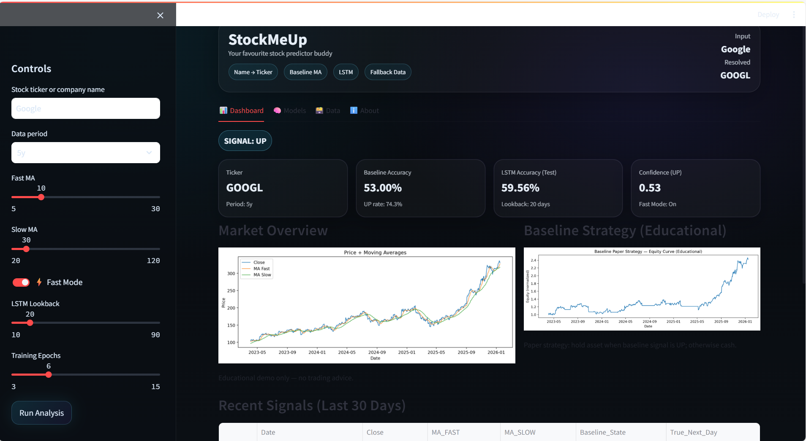
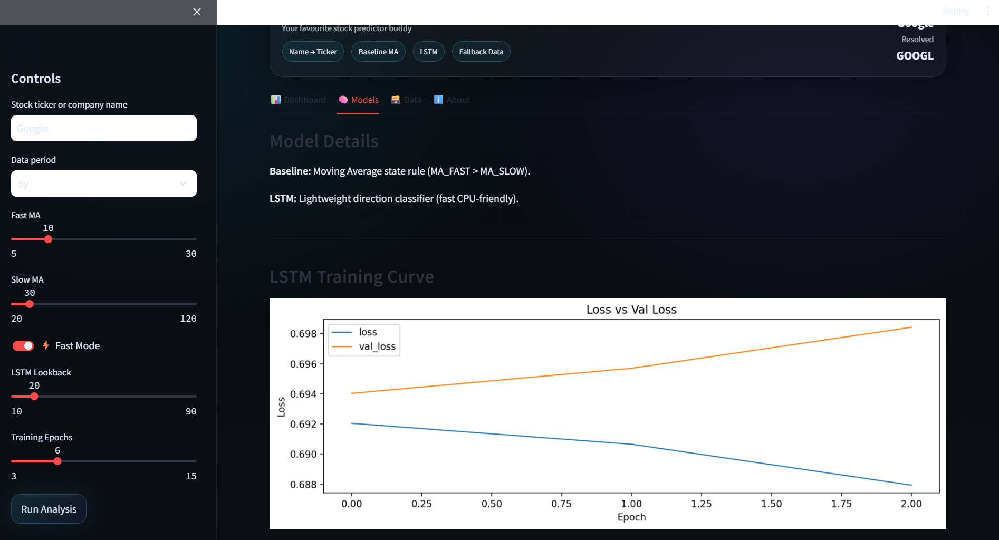

# ✨ StockMeUp — AI Stock Trend Predictor

> Your favourite stock prediction buddy  
> **Educational only - NOT financial advice**

---

## 🚀 Overview

**StockMeUp** is an educational AI-powered stock trend prediction system that allows users to enter **company names or stock tickers** and explore market trends through an interactive dashboard.

The project compares a **simple moving-average baseline** with a **lightweight LSTM neural network**, making it perfect for learning **financial time-series analysis**, **machine learning**, and **model evaluation** — without overwhelming complexity.

Built with usability in mind, StockMeUp works even for **non-technical users** who don’t know stock ticker symbols.

---

## ✨ Key Features

- 🔍 **Company Name → Ticker Resolution**  
  Type *Walmart*, *Netflix*, *Apple*, etc. — no ticker knowledge required.

- 📊 **Baseline Strategy (Moving Averages)**  
  Simple, interpretable rule: `MA_FAST > MA_SLOW`

- 🧠 **LSTM Direction Predictor**  
  Lightweight neural network predicting next-day price direction (UP / DOWN).

- ⚡ **Fast Mode**  
  CPU-friendly training for smooth demos and quick experimentation.

- 🌐 **Robust Data Loading**
  - Primary: Yahoo Finance (`yfinance`)
  - Fallback: Stooq CSV (when Yahoo is blocked or rate-limited)

- 🎨 **Clean Cyber UI**
  - KPI cards
  - Tabs (Dashboard / Models / Data / About)
  - Subtle gradients & grid aesthetic

---

## 🖥️ Demo Screens (UI Highlights)

- Hero dashboard with resolved company + signal
- Price chart with moving averages
- Baseline equity curve (educational paper strategy)
- Recent signal table
- LSTM training curves




---

## 🧠 Models Explained

### 1️⃣ Baseline Model — Moving Average Rule
A simple heuristic used as a benchmark:

```text
Signal = UP if MA_FAST > MA_SLOW
Why it matters:

Interpretable

Fast

Great comparison point for ML models

2️⃣ LSTM Model — Direction Classification
Input: historical closing prices

Output: probability of UP movement next day

Optimized for:

CPU usage

Short training times

Educational clarity

This is not a trading bot — it’s a learning tool.

⚙️ Tech Stack
Category	Tools
Frontend	Streamlit
Data	Yahoo Finance, Stooq
ML	TensorFlow / Keras
Analysis	NumPy, Pandas
Visualization	Matplotlib
Utils	scikit-learn

📁 Project Structure
text
Copy code
stockmeup-ai/
│
├── app.py              # Main Streamlit app (UI + logic)
├── model_utils.py      # Indicators + LSTM training
├── requirements.txt    # Python dependencies
├── README.md           # Project documentation
└── .venv/              # Virtual environment (local)
▶️ How to Run Locally
1️⃣ Clone the repo
bash
Copy code
git clone https://github.com/your-username/stockmeup-ai.git
cd stockmeup-ai
2️⃣ Create & activate virtual environment
bash
Copy code
python -m venv .venv
.\.venv\Scripts\activate   # Windows
3️⃣ Install dependencies
bash
Copy code
pip install -r requirements.txt
4️⃣ Run the app
bash
Copy code
streamlit run app.py
⚠️ Disclaimer
This project is created strictly for educational purposes.

❌ Not financial advice

❌ Not a trading system

❌ Not guaranteed predictions

Do not use this for real trading decisions.

👤 Credits
Built with ❤️ by Kashish Dhanani using:

Streamlit

TensorFlow / Keras

NumPy, Pandas, Matplotlib

scikit-learn

Yahoo Finance & Stooq data sources

Created as a learning + portfolio project to demonstrate applied machine learning and clean UI design.

⭐ Why This Project Matters
StockMeUp showcases:

Real-world ML on time-series data

Model comparison (baseline vs neural network)

Thoughtful UX for non-technical users

Clean, production-style project structure

Perfect for:

💼 Resume & portfolio

🎓 Learning ML concepts

🧪 Experimentation & demos

✨ If you like this project, feel free to star the repo! ✨

markdown
Copy code

---


